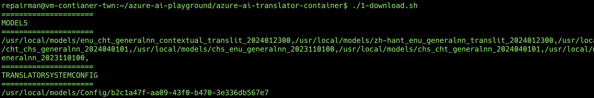
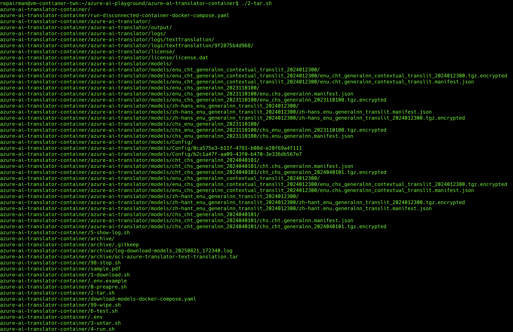
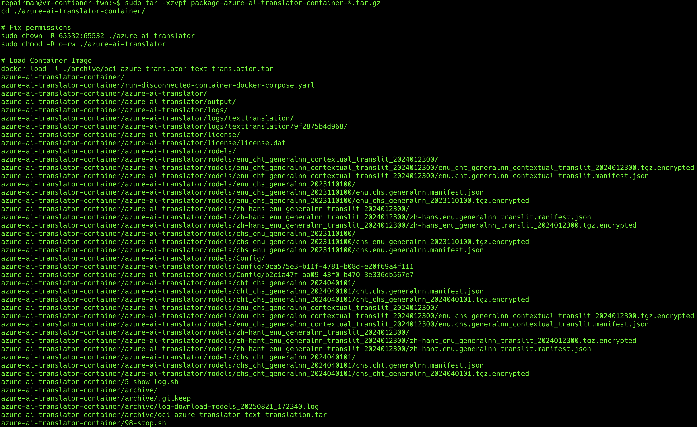
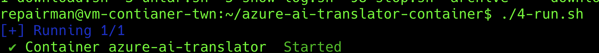
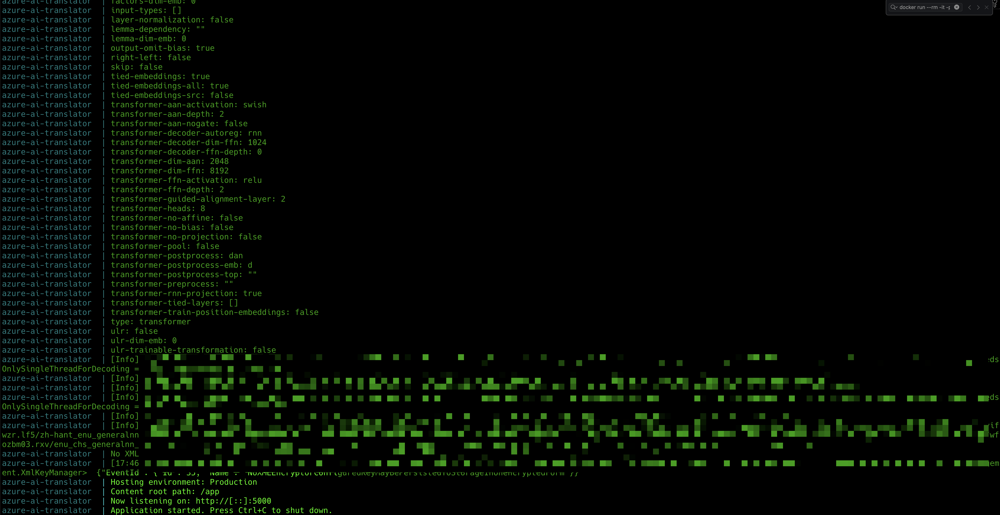
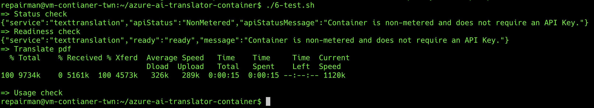
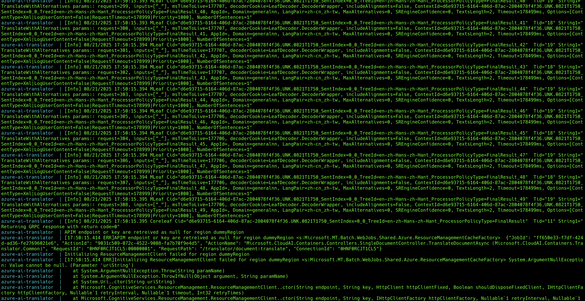

# Azure AI Disconnected Container 使用說明

> 20250822

這份文件是針對 Disconnected Container 的使用進行補充撰寫, 前 3 個步驟 0/1/2 需要保持在聯網狀態, 主要是要下載 container image 和 models, 之後的部分不需要聯網, 可完全離線運作

## 執行流程

### 0. 準備 (0-prepare.sh)

> 需連線至 Internet


1. 建立資料夾預備存放 MODELS / LICENSE / LOGS
2. 從網路下載 Container Image
3. 打包 Container Image 成 tarball, 預備將該映像檔放入離線環境運行

### 1. 下載 (1-download.sh)

> 需連線至 Internet



1. 請先確定 `.env` 是否有將 `TRANSLATOR_KEY` 和 `TRANSLATOR_ENDPOINT_URI` 填入, 可使用下列指令確保格式正確
    ```bash
    cp .env.example .env
    ```

2. 該程式主要是下載 Azure AI Disconnected Container 所需要的 `MODELS` / `LICENSE`
3. 最後會顯示 `MODELS` 和 `TRANSLATORSYSTEMCONFIG` 相關的字串, 請先記錄起來, 倘若忘記紀錄則可以去 `./archive/log-download-models-*` 裡面的 log 找尋相對應的字串
4. 打開 `run-disconnected-container-docker-compose.yaml` 檔案, 將 `TRANSLATORSYSTEMCONFIG` 和 `MODELS` 替換成下載時呈現的文字列

### 2. 打包 (2-tar.sh)

> 需連線至 Internet



1. 將整個資料夾打包起來, 放置於 `./archive/package-azure-ai-translator-container-*.tar.gz`, 裡面會包含會需要使用到的 Container Image 和 MODEL / LICENSE 們
2. 將上述的檔案用拉出來之後, 進行離線搬運的工作

### 3. 解壓縮 (3-untar.sh)

> 不需要連線至 Internet



因為你拿到 tarball 還沒解壓縮, 所以需要特別紀錄下列指令進行解壓縮動作

```bash
sudo tar -xzvpf package-azure-ai-translator-container-*.tar.gz
cd ./azure-ai-translator-container/

# Fix permissions
sudo chown -R 65532:65532 ./azure-ai-translator
sudo chmod -R o+rw ./azure-ai-translator

# Load Container Image
docker load -i ./archive/oci-azure-translator-text-translation.tar
```

動作是包含解壓縮, 修改權限至 non-root 和把 container image 匯入至本機

### 4. 運行服務 (4-run.sh)

> 不需要連線至 Internet



使用 docker compose 將 container 在背景運行起來, 因為在背景執行的原因, 所以需要使用 5-show-log.sh 才能看到背後的運行狀況

### 5. 顯示 Log (5-show-log.sh)

> 不需要連線至 Internet



最重要的就是最後幾行, 務必要看到 http://[::]:5000 才會運行成功

```bash
azure-ai-translator  | Hosting environment: Production
azure-ai-translator  | Content root path: /app
azure-ai-translator  | Now listening on: http://[::]:5000
azure-ai-translator  | Application started. Press Ctrl+C to shut down.
```

### 6. 測試 (6-test.sh)

> 不需要連線至 Internet

如果一切運作正常的話, log 應該會呈現下面的樣子



而 container log 則會瞬間大量跑出下列的 logs



## Q&A

### Q1: 如果出現在 2-download 下載 MODELS 出現 `Feature is not supported` 是什麼問題?

你的訂閱沒有申請通過可以下載容器的權限, 需要提交[申請表單][1]

### Q2: AI Disconnected Container 和 AI Connected Container 是否都需要提交表單? 兩者是否相同?

這兩個的申請表單是不一樣的, 差異在計費的部分是不是要連網, 如果不連網的話, 則要申請 Disconnected, 反之亦然

### Q3: 我可不可以使用 Connected Container 下載 MODELS 後, 給 Disconnected Container 使用?

實測不行, ENDPOINT / KEY / MODELS / LICENSE / IMAGES 目前判斷是強綁定關係, 不能拆開下載, 一定要同進同出, 所以我上面程式才要一次全部打包完, 沒有拆分太多動作

### Q4: 如果我在 6-test.sh 發現上傳檔案過了非常久都沒反應, 該怎麼處理?

1. `run-disconnected-container-docker-compose.yaml` 內的 `TRANSLATORSYSTEMCONFIG` 和 `MODELS` 參數寫錯, 需要檢查
2. 檢查 logs 看有沒有反應, 如果沒反應的話, 應該是這一包離線檔案有東西漏了, 建議重拉


[1]: https://learn.microsoft.com/zh-tw/azure/ai-services/containers/disconnected-container-faq
