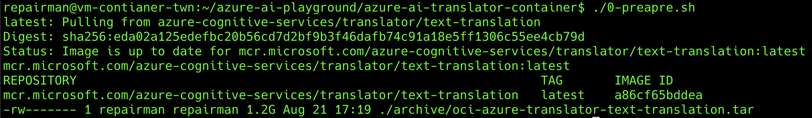

# Azure AI Disconnected Container 使用守則

##

### 0. 準備 (0-prepare.sh)

> 需連線至 Internet



1. 建立資料夾預備存放 MODELS / LICENSE / LOGS
2. 從網路下載 Container Image
3. 打包 Container Image 成 tarball, 預備將該映像檔放入離線環境運行

### 1. 下載 (1-download.sh)

> 需連線至 Internet


1. 請先確定 `.env` 是否有將 `TRANSLATOR_KEY` 和 `TRANSLATOR_ENDPOINT_URI` 填入, 可使用下列指令確保格式正確
    ```bash
    cp .env.example .env
    ```

2. 該程式主要是下載 Azure AI Disconnected Container 所需要的 `MODELS` / `LICENSE`
3. 最後會顯示 `MODELS` 和 `TRANSLATORSYSTEMCONFIG` 相關的字串, 請先記錄起來, 倘若忘記紀錄則可以去 `./archive/log-download-models-*` 裡面的 log 找尋相對應的字串

### 2. 打包 (2-tar.sh)

> 需連線至 Internet


1. 將整個資料夾打包起來, 放置於 `./archive/package-azure-ai-translator-container-*.tar.gz`, 裡面會包含會需要使用到的 Container Image 和 MODEL / LICENSE 們
2. 將上述的檔案用拉出來之後, 進行離線搬運的工作

### 3. 解壓縮 (3-untar.sh)


因為你拿到 tarball 還沒解壓縮, 所以需要特別紀錄下列指令進行解壓縮動作

```bash
sudo tar -xzvpf package-azure-ai-translator-container-*.tar.gz
cd ./azure-ai-translator-container/

# Fix permissions
sudo chown -R 65532:65532 ./azure-ai-translator
sudo chmod -R o+rw ./azure-ai-translator

# Load Container Image
docker load -i ./archive/oci-azure-translator-text-translation.tar
```

動作是包含解壓縮, 修改權限至 non-root 和把 container image 匯入至本機

### 4.