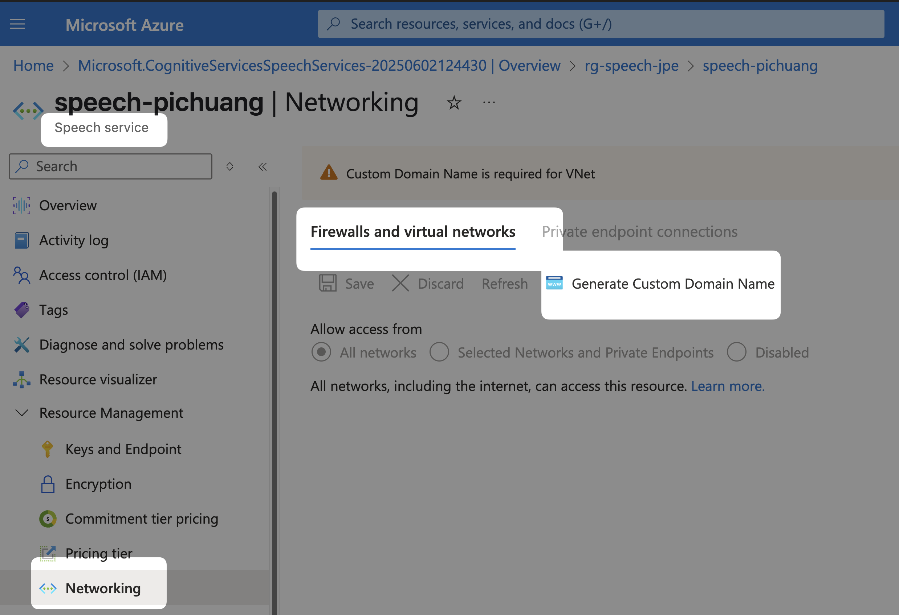

# Azure Speech Services

## Create Custom Domain

To configure your Speech resource for Microsoft Entra authentication, create a `custom domain name` and `assign roles`. Please see more details in [Configure the Speech resource for Microsoft Entra authentication][1]

## Enable Logging for DefaultAzureCredential

- [Usage guidance for DefaultAzureCredential][2]

[1]: https://learn.microsoft.com/en-us/azure/ai-services/speech-service/how-to-configure-azure-ad-auth?tabs=portal&pivots=programming-language-python#configure-the-speech-resource-for-microsoft-entra-authentication
[2]: https://learn.microsoft.com/en-us/azure/developer/python/sdk/authentication/credential-chains?tabs=ctc#usage-guidance-for-defaultazurecredential
